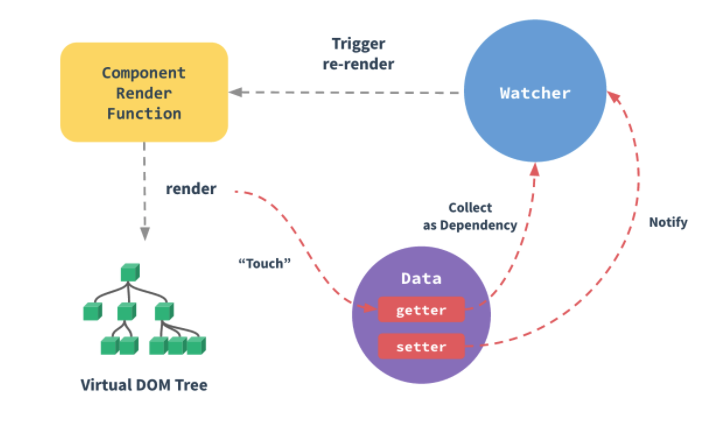

序言 
    本文只解读vue 2 版本的源码，至于vue-router、vuex 等我会持续更新

先借用官网的二张图，我们可以看到整个架构思想

> 双向绑定的原理
    第一张图主要讲述的的是Vue 的数据流向

> 获取el 渲染dom
    第二张图 主要讲述 vue 在执行过程中的执行顺序。理解第二张图，对vue的整个原理有非常大的帮助（源码层面和设计思想）

学习路径如下

-   [ ] scripts
-   [ ] src
-          - compiler
-          - core
-              - components
-              - global-api
-              - instance
-                   - render-helps
-                   - events.js
-                   - index.js
-                   - init.js
-                   - inject.js
-                   - lifecycle.js
-                   - proxy.js
-                   - render.js
-                   - state.js
-              - observer
-                   - array.js
-                   - dep.js
-                   - index.js
-                   - sceduler.js
-                   - traverse.js
-                   - watcher.js
-              - utils
-              - vdom
-          - platforms
-          - server
-          - sfc
-          - shared

[github 地址](git@github.com:wenwangzhishang/vue_code_explain.git)   
欢迎转发 star